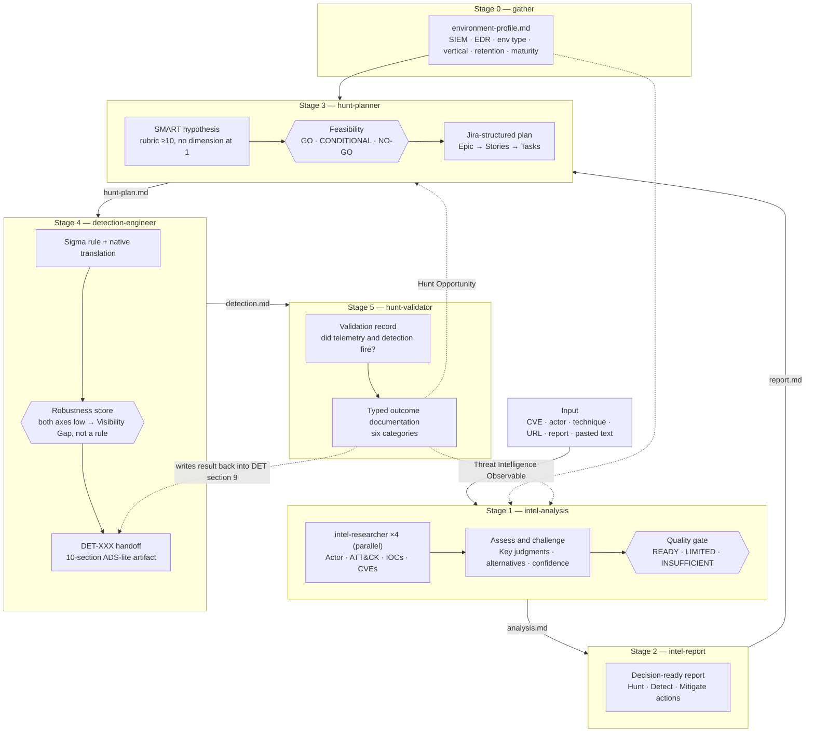

# Threat Intel Hunt Framework

A Claude Code plugin that turns raw cyber threat intelligence into a **hunt plan, a portable detection, and a validation record** by chaining six skills together. Each stage writes a file the next stage reads, and the whole chain follows the [Unified Threat Hunting Process](https://github.com/sims718718/UnifiedThreatHunting).

```
Environment gather → CTI input → intel-analysis → intel-report → hunt-planner → detection-engineer → hunt-validator
```

You hand it a CVE, an actor name, an ATT&CK technique, a URL, a report file, or pasted text. You get back six reviewable artifacts under `./threat-hunting/` in your own project.

---

## Contents

- [Why this exists](#why-this-exists)
- [How intel becomes a finished product](#how-intel-becomes-a-finished-product)
- [How the pipeline maps to the Unified Threat Hunting Process](#how-the-pipeline-maps-to-the-unified-threat-hunting-process)
- [Stage-by-stage walkthrough](#stage-by-stage-walkthrough)
- [Quality gates](#quality-gates)
- [Running it](#running-it)
- [Output convention](#output-convention)
- [Installing](#installing)
- [Repository layout](#repository-layout)
- [Scope and limitations](#scope-and-limitations)

---

## Why this exists

Threat intel reports rarely turn into detections on their own. The usual failure points are the same ones the Unified Threat Hunting Process was built to address:

- **Intel is repeated, not assessed.** Three blog posts echoing one vendor claim read like three confirmations.
- **Hunt plans reference data nobody has**, or queries written in the wrong dialect for the SIEM in use.
- **Hypotheses are vague** ("look for anomalous PowerShell") and cannot be disproven.
- **A hunt query gets shipped as a detection** with no blind spots, no false-positive estimate, and no triage guidance.
- **Nobody proves the detection would have fired.** A clean hunt result means little if the telemetry was never there.

This framework puts a gate at each of those points. The output of one stage is the input of the next, and uncertainty is carried forward rather than smoothed over.

---

## How intel becomes a finished product



The chain has four properties worth knowing before you read the stages:

1. **One slug ties everything together.** The slug is kebab-case, at most six words, derived from the input's primary subject. Every file in a run shares it, so each stage can find its predecessor's output (`<slug>-analysis.md` → `<slug>-report.md` → `<slug>-hunt-plan.md` → `<slug>-detection.md` → `<slug>-validation.md`).
2. **Files are the interface.** Stages do not pass state in memory. Each reads a named file and writes a named file, which is why you can start at any stage and why you can review or edit between stages.
3. **Gaps are annotated, not hidden.** Stages proceed with `Unknown`, `[FILL IN: …]`, `Not assessed`, or `[PENDING EXECUTION]` rather than inventing content or blocking.
4. **The loop closes.** Validation outcomes can feed new intel and new hunt ideas back into the front of the pipeline.

---

## How the pipeline maps to the Unified Threat Hunting Process

The Unified Threat Hunting Process runs: **Environment Context → Trigger → Hypothesis → Initial Assessment → Feasibility → Scope & Objectives → Formalize Hunt Plan → Execute Hunt → Document Outcomes → Report & Iterate**, then back to a new trigger.

This plugin automates the steps around the hunt, and leaves the hunt itself to you.

| Unified process step | Where it happens here | Notes |
|---|---|---|
| **Step 0: Environment Context** | `gather` → `environment-profile.md` | `hunt-planner` has an inline fallback interview if no profile exists |
| **Trigger** (CTI) | `intel-analysis` + `intel-report` | The intel report is the trigger artifact. `hunt-planner` also accepts other trigger types (see below) |
| **Hypothesis Development** | `hunt-planner` Step 2 | Seeded from the report's `Recommended Actions > Hunt`, then scored with the hypothesis rubric |
| **Initial Assessment** | `intel-analysis` (external evidence) and `hunt-planner` Step 3 (internal and external sources) | |
| **Feasibility Assessment** | `hunt-planner` Step 4 | GO / NO-GO / CONDITIONAL, with a DeTT&CT-style telemetry gap assessment |
| **Scope & Objectives** | `hunt-planner` Step 5 | |
| **Formalize Hunt Plan** | `hunt-planner` Step 6 | Jira Epic / Story / Task structure |
| **Execute Hunt** | **You** | Not automated. The plan gives you methodology, data sources, and detection logic to run in your own tools |
| **Document Outcomes** | `detection-engineer` + `hunt-validator` | Detection handoff, validation record, six typed outcome categories |
| **Report & Iterate** | `hunt-validator` outcomes | `Threat Intelligence Observable` and `Hunt Opportunity` outcomes point back to the start |

Two details on the mapping:

- **Trigger types.** The Unified Process defines seven: CTI, incomplete use cases, past incidents, red/purple team findings, MITRE ATT&CK TTPs, stakeholder requirements, and vulnerability disclosure. `hunt-planner` supports all of them when invoked standalone. The full pipeline starts from CTI because that is what stages 1 and 2 produce.
- **Hunt types.** `hunt-planner` carries the Unified Process's four hunt types (Exploratory, Hypothesis-Based, Threat-Informed, Purple Operations) as a quick reference. Output from this pipeline is Threat-Informed by construction.

---

## Stage-by-stage walkthrough

### Stage 0 — `gather`: capture the environment once

**Reads:** an existing `environment-profile.md`, if present.
**Writes:** `./threat-hunting/environment-profile.md`

Records six values: SIEM / data platform, EDR platform, environment type, industry vertical, approximate log retention, and hunt maturity level. These decide which query dialect you get, which telemetry fields are referenced, which time windows are feasible, and how much scaffolding the plan includes.

It has two modes:

| Mode | Triggered by | Behavior |
|---|---|---|
| **Standalone** | You, directly | Interviews you and records real values. Asks only about what is missing if a profile already exists. An Express path captures just SIEM and environment type |
| **Pipeline** | `/run-hunt-pipeline` (Step 1) | Never interviews. Reuses an existing profile untouched; otherwise infers what it can from the input and writes `Unknown` for the rest |

If a pipeline run left `Unknown` values, run `gather` standalone afterward to replace them with real ones.

### Stage 1 — `intel-analysis`: from raw intel to assessed evidence

**Reads:** your input, plus the environment profile if available.
**Writes:** `./threat-hunting/intel-analysis/<slug>-analysis.md`

This stage answers a decision-relevant intelligence question with traceable evidence and explicit uncertainty. It produces analysis, not hunt results and not detections.

What it does:

1. **Frames the question.** States the intelligence question, audience, scope, and collection cutoff. Relative dates become explicit start/end dates, and event dates are kept distinct from publication dates.
2. **Collects and evaluates evidence.** Every source gets an ID plus its locator, publisher, publication date, event period, evidence origin, and access limitations. Reposts of one report count as one origin. Search snippets and inaccessible pages are leads, not evidence.
3. **Researches four angles in parallel** by dispatching four `intel-researcher` subagents (falls back to doing it directly, and says so, if delegation is unavailable):
   - **Actor Profile** — aliases (scoped per publisher), attribution basis and disagreements, targeting, campaign timeline. Overlapping tracking clusters are not merged without evidence.
   - **ATT&CK / TTP Mapping** — procedure-level behavior with evidence. Observed procedures are separated from inferred mappings and historical capability.
   - **IOC Extraction** — exact source values with provenance. Labeled `Confirmed` (direct technical evidence in an original source), `Reported` (sourced assertion without it), or `Inferred` (analytical association). Missing values are never invented.
   - **Related CVE / Advisory Correlation** — separates exploitation by this actor, exploitation elsewhere, and mere product overlap. A CISA KEV entry alone does not establish attribution or local exposure.
4. **Assesses and challenges.** Builds a timeline, reconciles the four angles, and states for each judgment the evidence, reasoning, assumptions, counterevidence, confidence (High / Moderate / Low), and what would change it. The strongest plausible alternative is tested, including benign explanations.
5. **Applies the quality gate** (see [Quality gates](#quality-gates)) and records a status of READY, LIMITED, or INSUFFICIENT.

Researchers prefer sources from the curated list in [`skills/intel-analysis/references/high-reputation-sources.md`](skills/intel-analysis/references/high-reputation-sources.md). Membership on the list is a discovery aid, not proof; findings from outside it are flagged `[UNVERIFIED SOURCE]`.

The analysis file keeps a fixed section order for downstream compatibility: Source Material, Actor Profile (with Key Judgments and Operational Implications), ATT&CK / TTP Mapping, IOCs, Related CVEs / Advisories, Source Reputation Notes, and Open Questions and Gaps (with the Quality Gate).

> The analysis also offers *behavior + observable + likely telemetry* as seeds for hunting, but never claims local compromise, local visibility, or detection validation from external reporting alone.

### Stage 2 — `intel-report`: from analysis to a decision

**Reads:** `<slug>-analysis.md`. If none exists, it runs the analysis process itself or works from raw material you supplied, and notes in the report that formal analysis was skipped.
**Writes:** `./threat-hunting/intel-reports/<slug>-report.md` and an HTML twin (`<slug>-report.html`)

A report a decision-maker can act on without reading the raw research. Sections, in order: Executive Summary, Key Judgments (3–6, each labeled with confidence), Actor / Campaign Overview, MITRE ATT&CK Coverage, Indicators of Compromise, Recommended Actions, Confidence and Sourcing, and Appendix: Full Source List.

Design choices that matter downstream:

- **`Recommended Actions` is split three ways.** `Hunt` gives one-sentence hypothesis seeds in the form *"Hunt for [behavior] evidenced by [observable] in [likely data source]."* `Detect` separates strong standing-detection candidates from techniques too broad or noisy to detect without a hunt first. `Mitigate` captures patch and control changes the intel implies (for example, a CVE with an available patch).
- **`Inferred` IOCs are dropped** from the report unless you ask for full detail, so low-confidence indicators do not get actioned uncritically.
- **Open questions are carried forward** into Confidence and Sourcing, so a reader of only the report still sees what is unresolved.
- **The visibility column** in the ATT&CK table is answered only if your environment is known; otherwise it reads `Unknown — see hunt-planner Step 0`.

The HTML twin is a self-contained, double-clickable rendering of the same content. The Markdown file stays the source of truth.

### Stage 3 — `hunt-planner`: from report to a runnable plan

**Reads:** `environment-profile.md` (or runs its inline fallback interview) and `<slug>-report.md`, specifically its `Recommended Actions > Hunt` seeds and ATT&CK table.
**Writes:** `./threat-hunting/hunt-plans/<slug>-hunt-plan.md` and an HTML twin

This stage implements the planning phase of the Unified Threat Hunting Process:

| Step | What happens |
|---|---|
| 0 | Load the environment profile; pick the relevant row of the domain telemetry matrix (endpoint, on-prem AD, cloud IdP, cloud control plane) |
| 1 | Identify the trigger, using the intel report's hunt seeds when present |
| 2 | Write a SMART hypothesis and score it against the hypothesis rubric (Specificity, Testability, Falsifiability, Relevance, Pyramid level). **Threshold: 10 or more, with no dimension at 1.** A weak hypothesis goes back to be rewritten rather than consuming a sprint |
| 3 | Initial assessment from internal and external sources |
| 4 | Feasibility: data availability, data quality, skillset, timeline, tooling. Outcome is **GO**, **CONDITIONAL**, or **NO-GO** |
| 5 | Scope (segments, time window, assets, exclusions) and objectives |
| 6 | Formalize as Jira **Epic → Stories → Tasks** |

The output has a fixed order: Environment Profile, Epic, Stories, Tasks.

- The **Epic** holds the hypothesis, trigger, initial research, feasibility, scope, objectives, ATT&CK mapping, and required data sources.
- Each **Story** is a discrete investigation with methodology, field-level data sources, detection logic (pseudocode), and expected outcomes for both the malicious and benign case.
- **Tasks** are outcome placeholders using the six categories adapted from AIMOD2: New Hunt Idea, Analytics/Detection, Security Incident, Written Report, Visibility Gap, Security Control Issue. They get populated after the hunt is executed.

**Express Mode** produces a condensed skeleton for time-constrained requests (a single CVE or advisory with urgency, "quick plan"). It skips the full feasibility assessment and competing hypotheses, and stamps the document with a warning to upgrade to the full process before executing the hunt.

### Stage 4 — `detection-engineer`: from hunt logic to a handoff-ready detection

**Reads:** `<slug>-hunt-plan.md`, specifically the Environment Profile (to pick dialects), the Story's `Detection Logic` and `Expected Outcomes`, and the Epic's ATT&CK mapping. If no plan exists, it asks you for the finding directly and does not fabricate one.
**Writes:** `./threat-hunting/detections/<slug>-detection.md`

A hunt finding is not a detection. This stage produces the artifact detection engineering can actually accept:

1. **Builds the rule** using a six-step process (objective → log source → logic → ATT&CK mapping → detection level → false positives). The reference includes templates for process execution, command-line patterns, encoded PowerShell, registry persistence, C2 network connections, LSASS credential access, and webshell/dropper file creation.
2. **Writes Sigma as the portable primary.** If the environment profile names a SIEM (Splunk SPL, Sentinel/Defender KQL, Elastic DSL), it also produces a native translation. Sigma is never optional.
3. **Scores robustness on two axes** from Summiting the Pyramid: *observable robustness* (ephemeral value the adversary sets freely, or core to the technique?) and *event robustness* (application-layer and spoofable, or kernel/sensor-level?). **If both are low, it does not ship the rule.** It recommends a Visibility Gap outcome instead, because the rule would detect a tool and die with the next build.
4. **Fills the 10-section ADS-lite template** (an Alerting & Detection Strategy–style artifact): Goal, ATT&CK categorization, Strategy abstract, Technical context, Logic, Blind spots and assumptions, False positives, Robustness score, Validation, Priority and response.
5. **Self-checks against an acceptance gate.** The handoff is rejected if there is no validation result, blind spots are empty, false-positive volume is unknown, the primary condition is a hash/IP/domain, the robustness rationale is absent, or there is no response guidance.

Where validation has not happened yet, section 9 reads `Not yet validated — see hunt-validator` rather than staying blank.

### Stage 5 — `hunt-validator`: prove it, then close out the hunt

**Reads:** `<slug>-detection.md` and `<slug>-hunt-plan.md` (to check whether feasibility was CONDITIONAL).
**Writes:** `./threat-hunting/validations/<slug>-validation.md`, and **updates section 9 of the detection file in place**.

A hunt that finds nothing is only meaningful if you have shown you *would* have seen it.

**When validation is required**

| Situation | Required? |
|---|---|
| Hunt produced a candidate detection | Yes, and it blocks handoff |
| Clean hunt, feasibility was CONDITIONAL | Yes |
| Clean hunt, feasibility GO, technique never previously validated | Yes |
| Technique validated within the last 90 days, no stack change | No, cite the prior test |

**Procedure** (seven steps): select a test (Atomic Red Team preferred, CALDERA for chains, manual otherwise) → coordinate and record an approval reference → set a time marker → execute → query blind → record the result → clean up.

The skill cannot run an attack simulation itself. It either walks you through each step and records what you report, or, for a planning/documentation pass, fills the record with clearly marked `[PENDING EXECUTION]` fields rather than fabricating a result.

**How results are read**

| Result | Meaning | Action |
|---|---|---|
| No telemetry generated | Collection gap | Visibility Gap ticket; the hunt result is **not** a clean finding |
| Telemetry present, query missed | Logic or field-name error | Fix the query and re-run over the original window |
| Fired, but too late | Ingest/pipeline latency | Pipeline ticket |
| Fired as expected | Coverage claim supported | Attach to the handoff |

A false negative is the most valuable output here. It converts an assumed-covered technique into a measured gap.

**Typed outcomes.** Each hunt is closed out under one or more of six categories, each with its own documentation template:

| Outcome | Where it goes |
|---|---|
| Visibility Gap | Security engineering |
| Security Control Issue | Control owner |
| Detection Opportunity | Detection engineering (attach the DET artifact) |
| Hunt Opportunity | Back to hunt planning as a new hypothesis |
| **Suspicious Security Event** | SOC / IR. **Escalated immediately and first**, not just documented |
| Threat Intelligence Observable | Back to `intel-analysis` as new intel |

The skill includes a mapping from `hunt-planner`'s Task categories to these outcomes, so placeholders created during planning can be closed out cleanly.

**Bidirectional links.** The validation file carries `Source detection: DET-XXX`, and the detection file's section 9 is rewritten with the Method / Result / Evidence plus a pointer back to the validation record. The two files reference each other by ID.

---

## Quality gates

Each stage has a gate that stops weak work from flowing downstream looking strong.

| Stage | Gate | Rule |
|---|---|---|
| `intel-analysis` | 5-dimension rubric: decision/time scope, evidence traceability, analytical reasoning, alternatives, technical/operational relevance (0–2 each) | **READY** = 8–10 with no dimension at 0 and no integrity defect. **LIMITED** = usable with explicit collection gaps. **INSUFFICIENT** = central question unanswerable |
| `intel-analysis` | Integrity defects override the score | Fabricated evidence or IOCs, circular reporting presented as independent corroboration, unsupported actor/CVE linkage, out-of-window events presented as current, or external reporting presented as local validation must be corrected or removed, not merely labeled |
| `hunt-planner` | Hypothesis rubric (1–3 each) | 10 or more with no 1s proceeds; 7–9 gets one rewrite; 6 or lower returns to the backlog |
| `hunt-planner` | Feasibility | GO / CONDITIONAL / NO-GO |
| `detection-engineer` | Robustness score and acceptance gate | Both axes low means a Visibility Gap instead of a rule; six rejection conditions on the handoff |
| `hunt-validator` | Validation record | A detection artifact should not permanently read "not yet validated" once a run has occurred |

---

## Running it

**Whole pipeline, one input:**

```
/run-hunt-pipeline CVE-2026-41205
```

The argument can be a CTI report path, a URL, pasted text, a CVE ID, an actor name, a MITRE technique, or a rough idea. The command:

1. Runs `gather` in pipeline mode (reuses `environment-profile.md` if present, otherwise infers and marks `Unknown`)
2. Derives the slug
3. Runs `intel-analysis` → `intel-report` → `hunt-planner` → `detection-engineer` → `hunt-validator` in order
4. Prints a summary listing all six file paths and calling out any environment fields left `Unknown`

It does **not** pause between stages. Review the output files afterward. One exception: if `hunt-validator` surfaces a **Suspicious Security Event**, the command flags it before the final summary.

**One stage at a time.** Every skill triggers independently. If invoked standalone without an established slug, a skill looks for the most recent matching file from the previous stage and asks you to choose if there is more than one candidate. Examples of where you might enter midstream:

| You have | Start at |
|---|---|
| A new environment and no profile yet | `gather` |
| A vendor report or CVE to assess | `intel-analysis` |
| Finished analysis and need a briefing | `intel-report` |
| A technique or advisory and want a hunt plan | `hunt-planner` |
| A hunt finding or query to harden into a rule | `detection-engineer` |
| A rule you need to prove or a hunt you need to close out | `hunt-validator` |

**What to expect from an unattended run.** Because the pipeline cannot execute an attack simulation and does not stop to ask, validation fields will typically be marked `[PENDING EXECUTION]` until you run the test and report results. Treat the detection as a draft until a real validation record replaces that placeholder.

---

## Output convention

Every stage writes to fixed paths inside **your** project, never inside this plugin's repo.

| Stage | Output |
|---|---|
| gather | `./threat-hunting/environment-profile.md` |
| intel-analysis | `./threat-hunting/intel-analysis/<slug>-analysis.md` |
| intel-report | `./threat-hunting/intel-reports/<slug>-report.md` (+ `.html`) |
| hunt-planner | `./threat-hunting/hunt-plans/<slug>-hunt-plan.md` (+ `.html`) |
| detection-engineer | `./threat-hunting/detections/<slug>-detection.md` |
| hunt-validator | `./threat-hunting/validations/<slug>-validation.md` |

The Markdown file is always the source of truth. The HTML twins (intel-report and hunt-planner) are rendered in the same turn from a shared shell, for easy reading and sharing.

---

## Installing

The repo ships a `.claude-plugin/marketplace.json` and `plugin.json`. Install from a local clone:

```bash
git clone https://github.com/sims718718/agentic-threat-intel-framework.git
claude plugin marketplace add ./agentic-threat-intel-framework
claude plugin install threat-intel-hunt-framework@threat-intel-hunt-framework
```

On Windows, point `marketplace add` at the absolute path of your clone (for example `"D:\threat-intel-hunt-framework"`).

The plugin is not published to a public marketplace.

---

## Repository layout

```
.claude-plugin/
  plugin.json                  Plugin manifest (lists the six skills)
  marketplace.json             Local marketplace definition
.claude/settings.json          Enables the plugin for this repo
commands/
  run-hunt-pipeline.md         The end-to-end /run-hunt-pipeline command
agents/
  intel-researcher.md          Subagent: researches one CTI angle with an evidence contract
skills/
  gather/                      Stage 0: environment profile
  intel-analysis/              Stage 1: evidence-backed analysis
    references/                analysis-rubric.md, high-reputation-sources.md
  intel-report/                Stage 2: decision-ready report
  hunt-planner/                Stage 3: hypothesis, feasibility, Jira plan
    references/                hypothesis-templates, hypothesis-rubric, feasibility-checklist,
                               telemetry-gap-assessment, domain-telemetry-matrix,
                               data-source-explorer, hunt-maturity-model, jira-templates
  detection-engineer/          Stage 4: Sigma + ADS-lite handoff
    references/                sigma-rule-builder.md, detection-handoff-spec.md
  hunt-validator/              Stage 5: validation + typed outcomes
    references/                validation-hook.md, hunt-outcome-documenter.md
  _shared/references/          html-report-shell.md (HTML twin template)
scripts/
  validate-frontmatter.sh      Checks that a Markdown file's frontmatter fields are non-empty
```

---

## Scope and limitations

- **The hunt itself is yours.** The pipeline plans, specifies, and documents. Executing queries in your SIEM/EDR and running attack simulations are human steps.
- **No live integrations.** There are no custom MCP tools and no SIEM/API connections. Intel research uses built-in web search and fetch against a static, curated source list.
- **No hooks.**
- **No confirmation gates** between stages in `/run-hunt-pipeline`, including the non-interactive `gather` step.
- **External reporting is not local validation.** Findings describe what sources report. They say nothing about whether the activity is in your environment or whether you would see it until `hunt-validator` shows it.
- **Scores are workflow conventions**, not externally validated measures and not probabilities of correctness.
- **Review the output.** Treat each file as a draft for an analyst to verify.

---

## Related

- [Unified Threat Hunting Process](https://github.com/sims718718/UnifiedThreatHunting): the methodology this plugin implements

## License

MIT. See [LICENSE](LICENSE).
